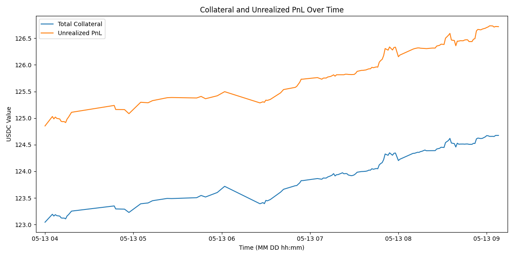

# overview.md

See above markdown file for current progress and a more detailed project breakdown

The following program is a sample market making strategy using the driftpy examples repo as its starting point. 

It's since been extended towards being more modular and being able to implement progressively more complex strategies through one framework. This interacts with the Javascript SDK as well.
This program interacts with drift protocol-v2 using python sdk

dependencies: [driftpy](https://drift-labs.github.io/driftpy/)

## Quick Setup

creates a virtualenv called "venv"

```
python3.10 -m venv venv
source venv/bin/activate
pip install -r requirements.txt
```
## Quick Run

Your Solana private key (either base58 string or base64 bytes) can be placed in .env in main directory with ANCHOR_WALLET=path/to/id.json
If not, when running the main.py file specify the path to your private key json file via --keypath.

Running the following command and you will be prompted to choose between running from different strategies in src/strategies. You will be prompted to select a number but any key diverts to default, the only implemented (for now)

add --keypath [path name] to command to specify location of private key
add --console [yes/true or no/false] to specify if you'd like detailed console messages regarding DLOB, Market and User data fetched from drifpy.
```
python src/main.py
```

The bot is currently live, below is a sample pic from 5 hours of use while fixing some final bugs in the market logic. 

[Block Explorer](https://explorer.solana.com/address/81mEWGuceyAhPH6GZjX8jcXETrrcGMYzJUBCgsiu7f4W?cluster=devnet)

[Drift Beta Exchange Link](https://beta.drift.trade/overview/history/tradeHistory?userAccount=81mEWGuceyAhPH6GZjX8jcXETrrcGMYzJUBCgsiu7f4W)

```
python floating_maker.py --amount .1 --market SOL-PERP
```

## Disclaimer

This is experimental software is for educational purposes only on a developer testnet. USE THIS OPEN SOURCE SOFTWARE AT YOUR OWN RISK. THE AUTHORS AND ALL AFFILIATES ASSUME NO RESPONSIBILITY FOR YOUR RESULTS.
